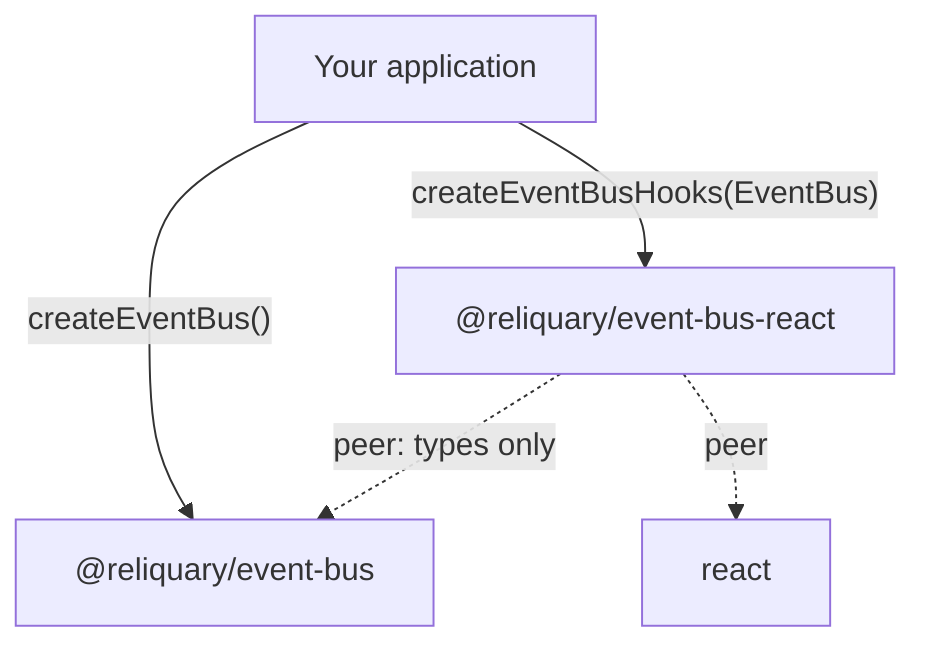
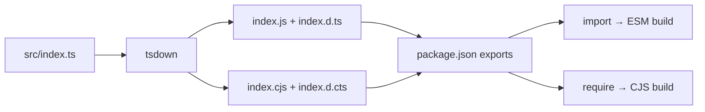
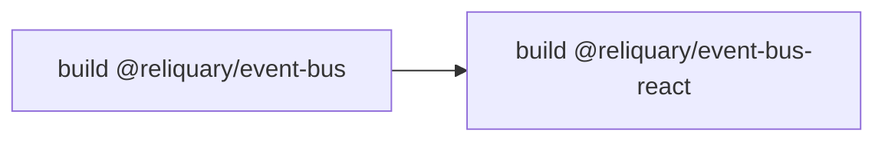
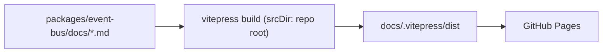
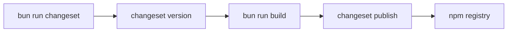

# Architecture

How the two packages relate, what depends on what, and how they are built and
published.

## Packages

| Package | Role | Runtime dependencies |
| --- | --- | --- |
| [`@reliquary/event-bus`](./event-bus.md) | Pure-TS core | none |
| [`@reliquary/event-bus-react`](./event-bus-react.md) | React 18/19 hooks | none (core + react are peers) |

## Dependency graph

A consumer installs both packages. The react package depends on the core as a
**peer dependency** and uses it for **types only** — at runtime it merely calls
methods on the bus instance the consumer hands it. This guarantees a single shared
core instance and keeps the react bundle from pulling in any core runtime code.

Solid arrows are direct runtime use; dashed arrows are peer dependencies.

## Build pipeline

Each package is built independently by **tsdown**, which emits an ESM bundle, a
CommonJS bundle, and matching type declarations for each format. The `exports` map
in `package.json` routes consumers to the right files per module system.

Because `package.json` sets `type: module`, the ESM bundle is `index.js` with
`index.d.ts` types, and the CommonJS bundle is `index.cjs` with `index.d.cts` types.
Packaging correctness is gated in CI by `@arethetypeswrong/cli` and `publint`.

## Build order

The react package resolves `@reliquary/event-bus` from its built output, so the core must
be built first. `bun run build` enforces this order (core, then react); for active
development, run `tsdown --watch` in the core package.

## Documentation site

These pages are part of the single reliquary [VitePress](https://vitepress.dev) site whose
shell (config + landing) lives at `docs/` (`docs/.vitepress/config.mts`). The event-bus
guides themselves live **inside the package** at `packages/event-bus/docs/`; the config sets
`srcDir: '..'` (repo root) and `rewrites` to pull them into the site under `/event-bus/`.
Mermaid diagrams render via `vitepress-plugin-mermaid`. `bun run docs:build` produces a
static site in `docs/.vitepress/dist`, and the `Deploy docs to Pages` GitHub Actions
workflow (`.github/workflows/docs.yml`) builds and deploys it to GitHub Pages on every
push to `main`. The site is served under the `/reliquary/` base path at
<https://alexdm0.github.io/reliquary/>.

## Release flow

Versioning and publishing are managed by **Changesets** with independent versions
per package. The core publishes before the react package to satisfy the peer
relationship.

