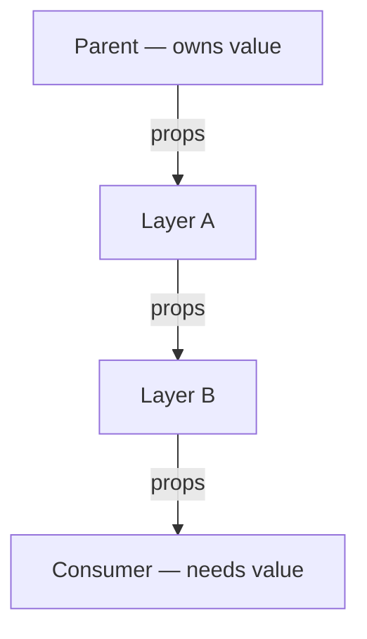
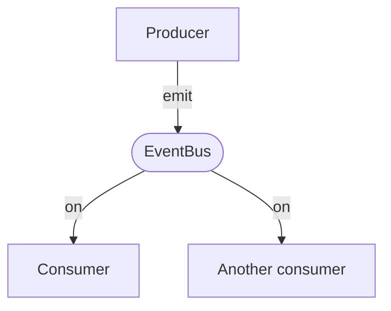
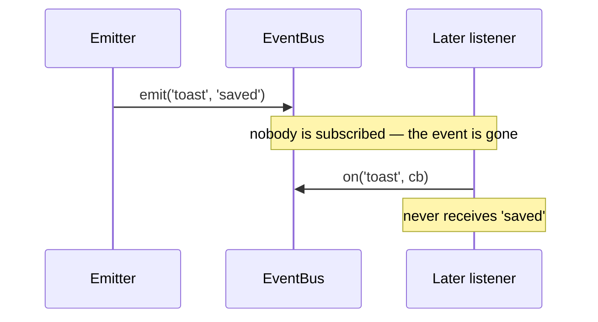
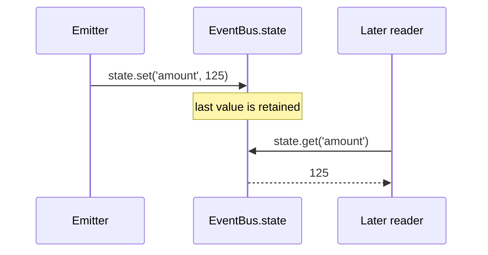

# Concepts

Why an event bus, the mental model behind it, and when to reach for one — context
for [`@reliquary/event-bus`](./event-bus.md) and [`@reliquary/event-bus-react`](./event-bus-react.md).

## Why events

Events let parts of an app communicate without wiring them together directly. They
can:

- **Decouple code** — producers and consumers never import each other.
- **Break circular dependencies** — communication goes through a neutral bus.
- **Flatten React render trees** — distant components talk without lifting state or
  threading props through every layer.
- **Improve performance** — nothing re-renders unless a component explicitly chooses
  to (`useEvent` / `useSharedState`); `useEventCallback` never re-renders.

Events sit at the most-decoupled end of a spectrum: direct calls → shared
variables → callbacks → delegates → **events**. The more decoupled, the less the two
sides need to know about each other.

## Events are like a radio

The bus broadcasts; whoever is tuned in hears it. Three properties follow:

> An emitter does not know or care who listens. Events are lossy. Events do not
> expect a response.

Keep this in mind — it explains both the strengths (decoupling) and the one real
footgun (loss), below.

## Flattening the render tree

Without a bus, a value owned high in the tree must be passed through every
intermediate component to reach a distant consumer ("prop drilling"):

With a bus, the producer and consumer connect directly, regardless of where they sit:

## Events are lossy

An emit only reaches listeners that are **subscribed at that moment**. A component
that mounts later misses what already fired:

This is by design. When a late consumer **must** still get the value, use **shared
state** instead — `EventBus.state` retains the last value, so reads after the fact succeed:

In React this is exactly the difference between `useEvent` (live notifications, lossy)
and `useSharedState` (reads the current shared value, even on a late mount).

## When to use events

- Shared state **within a single page**, for performance or simplicity.
- Messaging **across modules** that should stay decoupled.
- Cases where consumers are **mounted/active when the event fires**.

## When not to use events

- When a plain React pattern (`useState`, lifting state, Context) already does the job.
- When the data must **persist across sessions**.
- When a consumer might **not be subscribed at emit time** and still needs the value —
  reach for shared state, or a dedicated store.

## Events vs. shared state vs. a store

These are complementary, not competing — they can live side by side.

| Need | Reach for |
| --- | --- |
| Fire-and-forget notification to whoever is listening | **Events** (`useEvent` / `useEventCallback`) |
| Last-value-wins state shared across a page, late readers included | **Shared state** (`EventBus.state` / `useSharedState`) |
| State across pages/routes, async producer/consumer, persistence, complex data | A store like **Zustand / Redux** |
| Rarely-changing dependency injection down a subtree | **React Context** |

An event bus and a global store solve different problems; pick per use case rather
than treating one as a replacement for the other.
