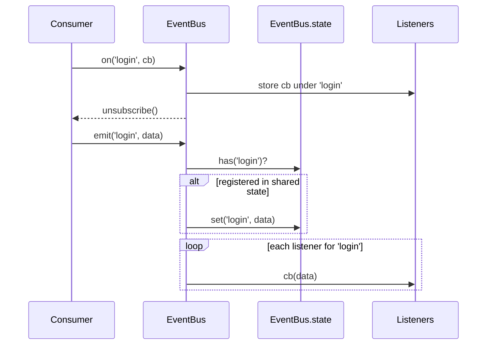
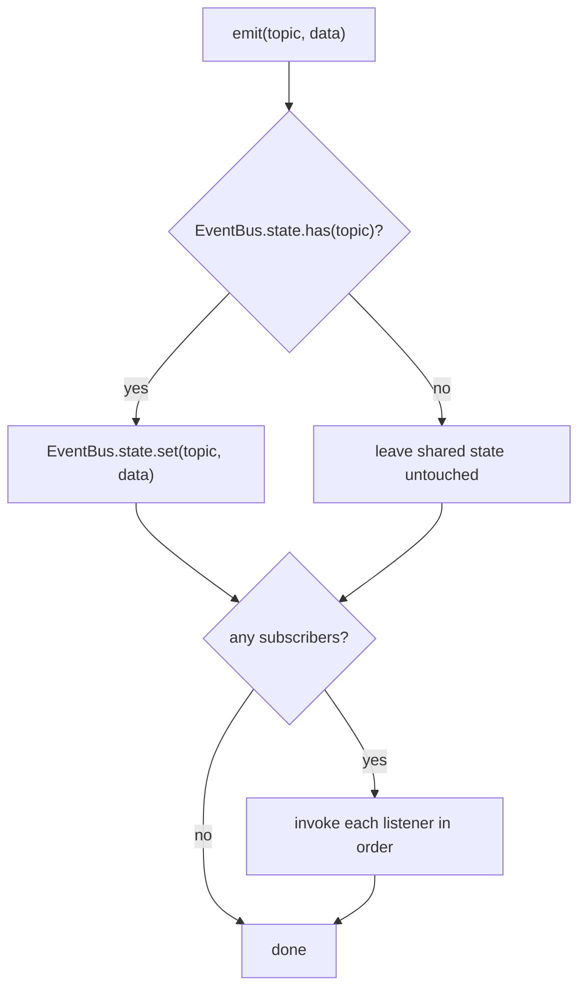
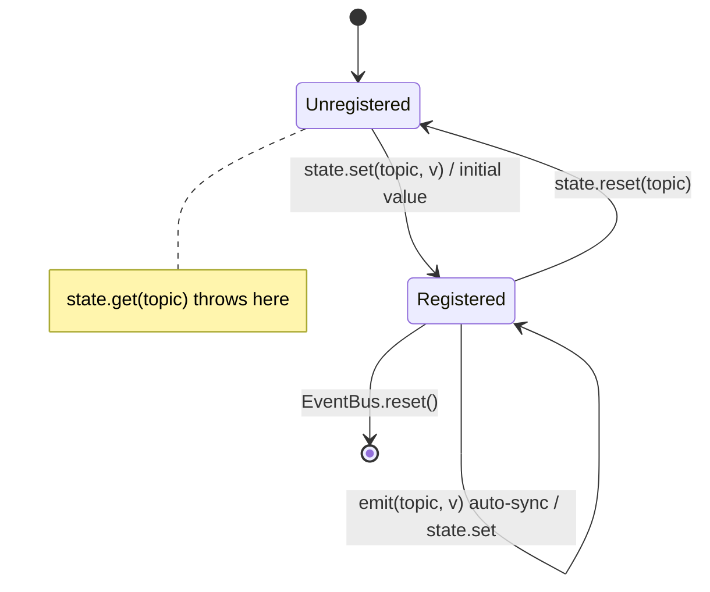
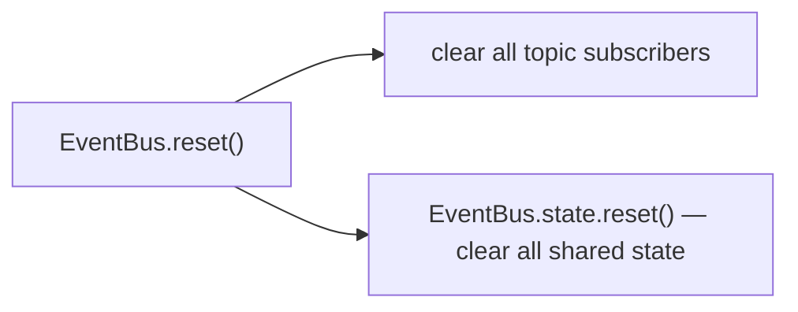

# Event flow

How subscriptions, emits, and shared state behave at runtime in
[`@reliquary/event-bus`](./event-bus.md).

## Subscribe and emit

`on` stores a listener under its topic and returns an unsubscribe function. `emit`
synchronously notifies every listener for the topic, in subscription order, and — if
the topic is registered in shared state — updates that stored value first.

## Emit

`emit` keeps shared state in sync independently of whether the topic has listeners,
and only for topics already registered in shared state — it never starts tracking a
new topic on its own.

Listeners may subscribe or unsubscribe themselves or others during an emit; the
iteration is safe. A listener removed before it is reached is simply skipped, and a
listener added mid-emit is not invoked for the in-flight emit — it becomes active from
the next emit. The delivery set is fixed when the emit starts.

Delivery is **fail-fast**: a listener that throws aborts the loop — later listeners are
not called and the error propagates to whoever called `emit`. Errors are not caught or
isolated; shared state (synced before delivery) is already updated when this happens.

## Shared-state lifecycle

A topic's shared state moves through three observable states. `get` succeeds only
while the topic is registered.

## Reset

`EventBus.reset()` clears both halves of the bus at once — every subscriber across
every topic, and all shared state — leaving a clean, reusable bus.

