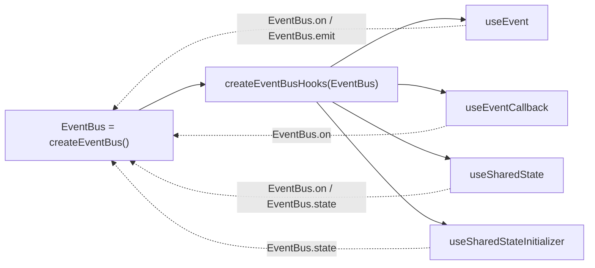
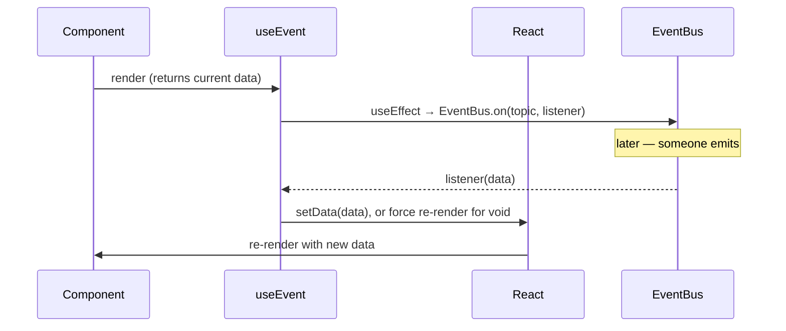
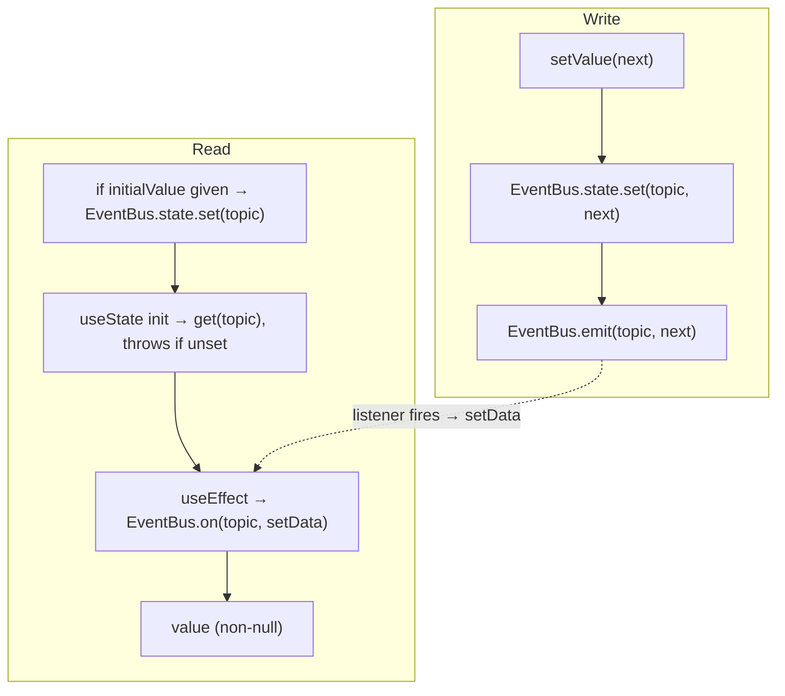

# React data flow

How [`@reliquary/event-bus-react`](./event-bus-react.md) connects a bus to React using
`useState` + `useEffect`.

## Factory binding

`createEventBusHooks(EventBus)` closes over one bus instance and returns four hooks
all bound to it. There is no Context and no module-level singleton — the binding is
the closure. This is what fixes the classic bug of each hook accidentally owning a
separate bus.

## useEvent

`useEvent` subscribes to the topic in a `useEffect` and stores the latest payload in
`useState`. For `void` topics there is no payload, so it bumps a small force-update
counter instead — that way every emit still triggers a render.

The subscription is torn down on unmount or when `topic` changes (the effect's only
dependency).

## useSharedState

`useSharedState` stores `initialValue` (when given) during render, reads the current
value in `useState` — throwing if the topic was never initialized — and subscribes for
updates. The setter persists to shared state and emits, so every component bound to the
topic on the same bus re-renders. The returned value is non-null.

Because the value is persisted in the shared bus rather than living only in component
state, two unrelated components calling `useSharedState('count', 0)` stay in sync.

## Design notes

| Concern | How the hooks handle it |
| --- | --- |
| Stale closures | `useEventCallback` reads the callback from a ref updated on every render, so it never fires a stale one. |
| Redundant re-subscribes | Subscriptions are keyed on `topic`, recreated only when it changes — not on every render. |
| `void` / repeated emits still re-render | `useEvent` bumps a force-update counter when the payload is `void`. |
| Server rendering | Subscriptions live in effects (which don't run on the server); the first render returns `null` or the seeded value. |

> **Trade-off.** These hooks use the simple `useState` + `useEffect` model. They are
> not protected against tearing under React's concurrent features, and an emit that
> lands between a component's render and its effect-subscribe can be missed. If your
> app relies heavily on concurrent rendering, wrap reads in
> [`useSyncExternalStore`](https://react.dev/reference/react/useSyncExternalStore).
